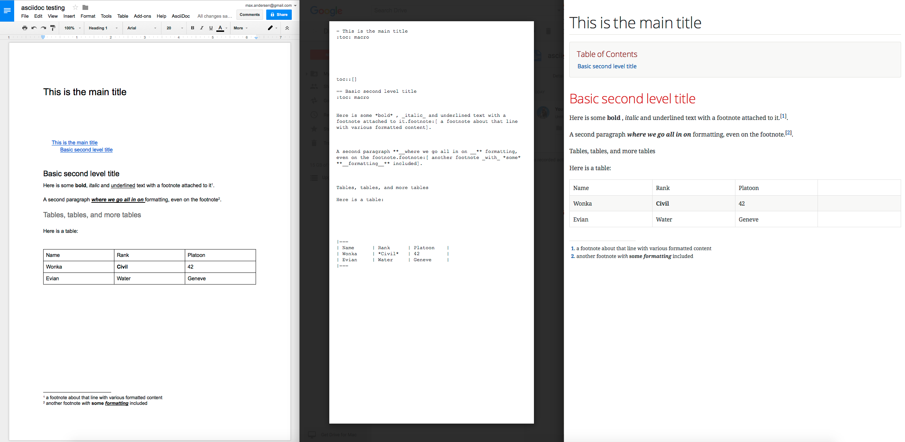

gdoc2adoc
========

A simple Google Apps script to convert a properly formatted Google
Drive Document to asciidoc (.adoc) format, or rather more precisly
asciidoctor compatible format.



== Try it

You can explore this script on this https://docs.google.com/document/d/19VD9FCTj6tHeWxdhkmctA1r9Ko3surX3Ee8wp_iwlo4/edit?usp=sharing[Google Doc] document - you just need to copy this to your own Google Drive to be able to run the script via the Tools or AsciiDoc menu.

== Usage

* Adding this script to your doc (once per doc):
** Open your Google Drive document (http://drive.google.com)
** Tools -> Script Manager > New
** Select "Blank Project", then paste this code in and save.
*** Clear the myFunction() default empty function and paste the contents of `converttoasciidoc.gapps` into the code editor
*** File -> Save
    
* Running the script (run as many times as you want):
** AsciiDoc > Export File (Creates a new folder `target` in the same directory as the document. AsciiDoc and image files are stored in it. A warning is generated if a `target` directory already exists) 
** AsciiDoc > Export Email (Sends you an email with the AsciiDoc and image files)

== Interpreted formats

Things not yet handled proper asciidoc way is marked with a todo.

* Text:
** paragraphs are separated by two newlines
** text styled as heading 1, 2, 3, etc is converted to AsciiDoc heading: =, ==, ===, etc
** TODO: text formatted with Courier New is backquoted: ``text``
** links are converted to asciidoc format: `url[anchortext]`
* Lists:
** Numbered lists are converted correctly, including nested lists
** bullet lists are converted to "`*`" AsciiDoc format appropriately, including nested lists
** Honors linebreak in paragraphs by using asciidoc line continuation ('+' on empty line) 
* Images:
** images are correctly extracted and sent as attachments
* Drawings: 
** not supported - there seems to be no API function to export a drawing as a rasterized or vector image. 
* TODO: Equations:
** Equaations are not supported.
* Table of contents:
** Is handled by asciidoctor `toc` macros
* Horizontal line: 
** Inserts a `---`
* Header/Footer:
** Extracts text with all formattings and inserts it at the top and bottom of the AsciiDoc document, seperated by `---`.
* Tables:
** Converted to AsciiDoc tables. Formatting within cells gets transferred.
* Source code: 
** Fenced code blocks are started by three back-ticks and a string and ended by three back-ticks. If such a fenced code block is detected, single line break is used within it. 

== Reading materials

Documentation about https://developers.google.com/apps-script/guides/docs[Google Documentation document structure]

== CONTRIBUTORS

* Heavily inspired by https://github.com/jacksonicson/gdocs2md

== LICENSE

Use this script at your will, on any document you want and for any purpose, commercial or not. 
The AsciiDoc files generated by this script are not considered derivative work and 
don't require any attribution to the owners of this script. 

If you want to modify and redistribute the script (not the converted documents - those are yours), 
just keep a reference to this repo or to the license info below:

```
Copyright 2013 Google Inc. All Rights Reserved.

Licensed under the Apache License, Version 2.0 (the "License");
you may not use this file except in compliance with the License.
You may obtain a copy of the License at

    http://www.apache.org/licenses/LICENSE-2.0

Unless required by applicable law or agreed to in writing, software
distributed under the License is distributed on an "AS IS" BASIS,
WITHOUT WARRANTIES OR CONDITIONS OF ANY KIND, either express or implied.
See the License for the specific language governing permissions and
limitations under the License.
```
